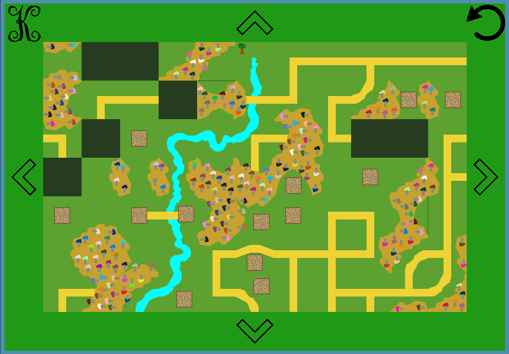
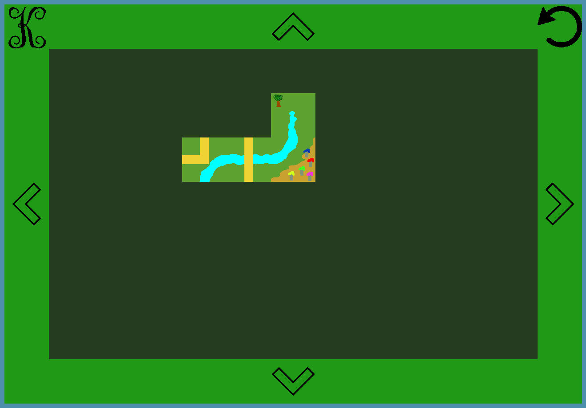

# Carcassonne
- stack
`pyQt6`
- to run
`python3 main.py`
- description
Кнопка `K` выдаёт фишку, круговая стрелка даёт возможность поворачивать эту фишку. Прямые стрелки управляют расположением всего поля. Игрок выставляет фишки на игровом поле так, чтобы они составляли цельную картину. Реку можно "подсоединить" только к реке, дорогу к дороге, город к городу, поле к полю.
Каждый раз получается разная картина.

